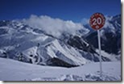
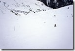
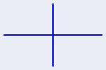

There’s a very basic distinction in kinds of pictures (and therefore kinds of graphics) we use with computers. The difference is really simple, but very difficult to describe precisely. In fact, we don’t even have great words for the two categories.
<!--more-->

In the old days, they referred to the two types as “raster” and “vector”. I prefer “image-based” and “object-based”.

Here’s a first attempt at the definitions:

+ An **image-based** (or raster) graphic represents the pictures by measuring the color at a pre-determined set of locations (usually a grid). Think of a picture taken with a digital camera: it tells you a color for each point taken on a fixed grid.

+ An **object-based** (or vector) graphic represents the picture by describing the objects in the picture in a mathematical way. For example, I might list the 2D things (lines, circles). The number and positions of these objects can vary.

One of the reasons this gets a little tricky is that we rarely look at an object-based graphic directly. Our display devices are pretty much all image-based. LCD screens, laser and ink-jet printers, CRT monitors, computer projectors – all show raster images (regular grids of color measurements). So, if I try to show you an object-based graphic, it would be converted to an image-based graphic so that it could be displayed. The process of converting an object-based representation to an image-based one is called **rendering**.

The simplest form of image-based graphic is a grid of pixel values, where each pixel is a color or brightness. Each one is a measurement of what we see at a particular place. Those places are fixed. If we have a different picture (of the same size), we change the colors at those positions. For example, every picture that my digital camera takes has the same regular grid of pixels. At each position on that grid a picture has a color. Whether I take a picture of a white wall, or some complex street scene or landscape, it’s always the same grid – it’s just that the patterns of colors are more or less complex.

&nbsp;

&nbsp;

Above are three pictures taken with my digital camera (greatly reduced in size). Each has the same 150x100 grid of pixels, even thought the images are quite different. In an image-based graphic, the places where colors are measured are fixed, while the colors at these positions are different.

A simple form of object-based graphic is a 2D vector graphics image, where the picture is represented by a list of 2D objects like lines and circles. These simple pieces are called **primitives**. An object-based picture might be a list of these primitives. Note that each primitive can be varied in position, and more can be added to make a more complex picture.

 &nbsp;  &nbsp; 

Above are three "vector-graphics" pictures. The first two have two lines, albeit in different places and with different colors. The last one is just a grey rectangle. It (should) look the same as the right-most picture above (of the image-based examples).

Note that your web browser has rendered the vector graphics to images to show on your screen.

Object-based graphics are even more common in 3D, where we describe “scenes” as collections of 3D objects. We will typically do this by breaking the scene up into small objects (called primitives).

Let’s contrast those rightmost pictures in each of the boxes. They both appear as grey rectangles. The difference is in the representation. The image describes the color at every pixel on a regular grid. Since the picture is 150 pixels wide and 100 tall, this means the picture is a list of 15,000 colors (one for each pixel). They just all happen to be gray. The vector picture representation just says “gray rectangle” (with some other information that says where the rectangle goes).

For a simple picture (like a gray rectangle), an object representation is more convenient since its easier to specify and easier to change. For a complex picture (like a mountain scene), an image representation is more convenient since it would be really hard to make the exact mountain you see out of simple primitives (whereas, you can make the picture easily with a camera).

## What’s so hard about this?

For image-based graphics, it’s easy enough to say “an image is a grid of pixels.” Except that it doesn’t have to be a grid, and I haven’t explained what a pixel is. We'll talk about pixels at some point in the future (see {} for the quick version). If you don’t want to be really precise, and only care about the common cases (or the cases you’re likely to encounter), the distinction really is simple.

The thing that really defines “images” in the sense we’re talking about is that the are sampled representations (we’ll explain what this means at some point – for now, you can think of “we make a measurement at a specific point”) where those samples are taken at specific locations.

Usually in 2D, when we make images, we sample in a (rectangular) grid. A square pattern. it doesn’t have to be that way. We are unlikely to encounter another sampling pattern in class.

From the other perspective, we haven’t really defined object-based graphics very well either. A graphic is a collection of primitives (which we haven’t been too specific about). Of course, our definition has to make it such that a sample isn’t a primitive, otherwise an image-based graphic would be an object-based graphic.

## 2D and 3D

You can have 3D images – it’s just that the sample positions are in 3D space. You can sample in a grid pattern, or some other pattern.

In this class, we will usually only talk about 2D images. Most of the stuff we do in 3D will be object-based, and we’ll talk about the process of rendering those 3D object representations into 2D images.

3D (and higher) images do exist. In fact, image-based 3D is especially important for medical applications (called volumes) and other places where you are trying to understand what happens “inside” of a solid object. We’ll come back to talking about these volumes at the end of the class (if time permits).

Computer graphics is usually concerned with making pictures of things, so we don’t worry about the insides as much. So typically, when we make 3D things, we only model their outside appearance, and then render them to 2D images. Of course, with the growing importance of 3D medical imaging and 3D fabrication (e.g. 3D printers), learning to model the insides become more important.

## In a Graphics Class

Traditionally, computer graphics classes have focused on object-based graphics. It’s often what you think about as “graphics”: making pictures out of complicated 3D objects and then rendering them into 2D images. Images typically were discussed in a different class (like “Image Processing” – nowadays we might call it “Computational Photography”).

However, understanding images is really important for a number of reasons.

+ If you make an object-based representation, you will ultimately need to make an image if you want to see it. So, understanding images will come up (unless you let someone else take care of the rendering for you, which actually isn’t such a bad idea). Note that there are plenty of reasons why you might make an object-based representation of a 3D object besides making a picture of it.
+ Images are increasingly common in computer graphics. With the advent of the digital camera, image-based graphics are everywhere. If you look on your cell phone, most web-pages, in the movies, on pages of a book or magazine, etc. you will see examples of image-based graphics (even if you don’t know know it – most pictures these days, in print, television, and movies, etc. are digital).
+ In fact, you don’t see object-based graphics except in specialized cases. Text (like this web-page) is an important special case. But how often do you actually encounter 3D graphics in your regular life? (other than say, in a computer game, or as a special effect in a movie)
+ Even then, images are a critical part of object-based graphics. Often we describe objects by talking about the images that define their appearance (we’ll discuss this as “texture-mapping” later in the class). And of course, we’ll need to consider how those object-based graphics are ultimately going to be rendered to images.

So, (in this class at least) expect to learn about both object and image based graphics.

## Words You Need to Know

+ image-based (or raster) graphics
+ object-based (or vector, or primitive-based) graphics
+ render (rendering) – note that sometimes rendering refers to the more general process of converting from one representation to another, and other times it refers to the specific problem of creating a 2D image from a 3D scene description
+ primitives
