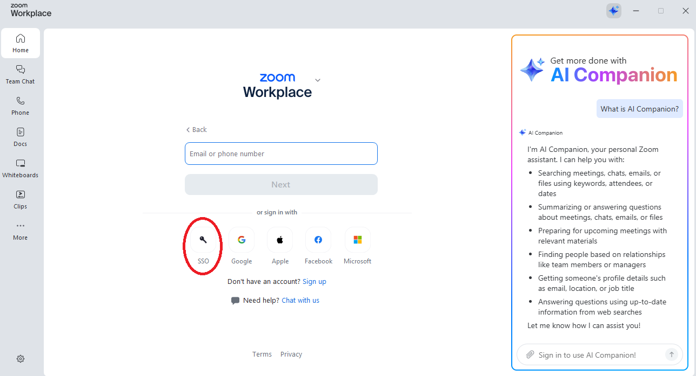
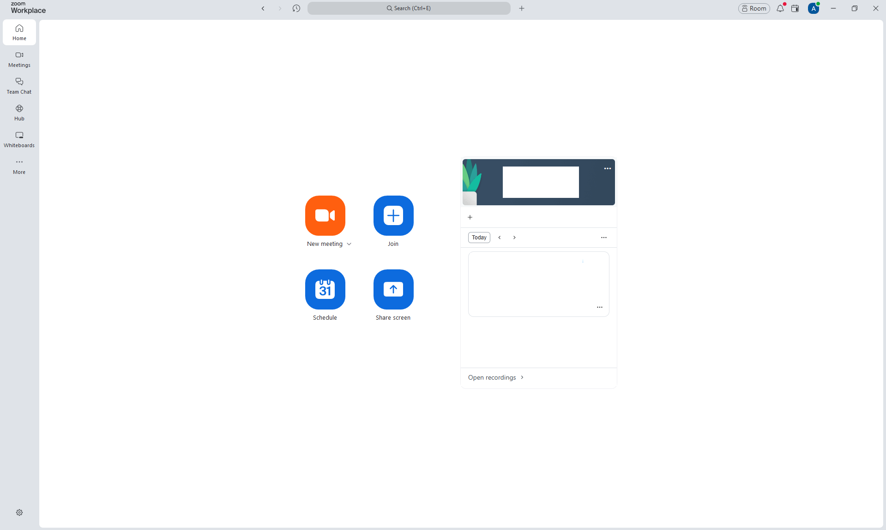
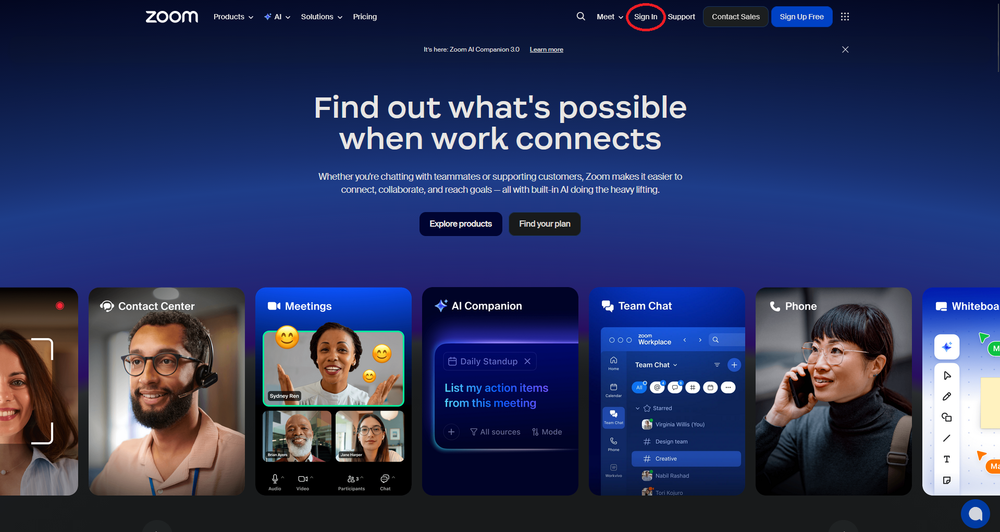
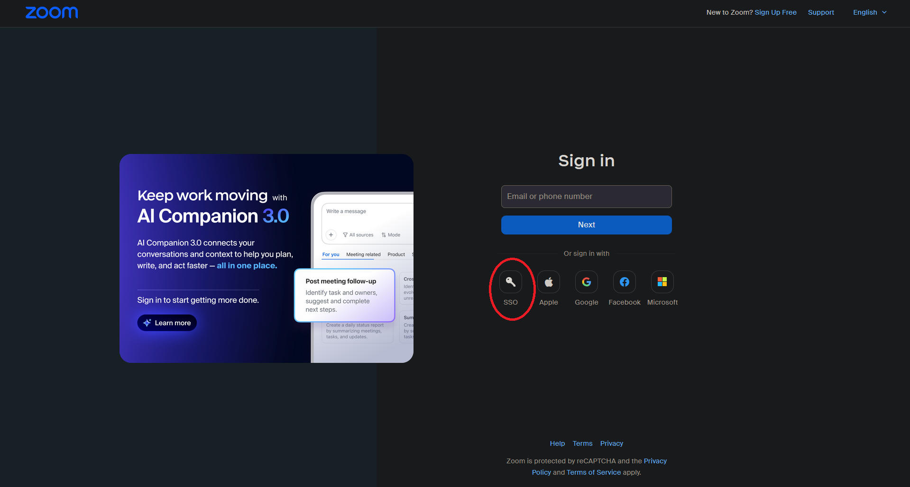
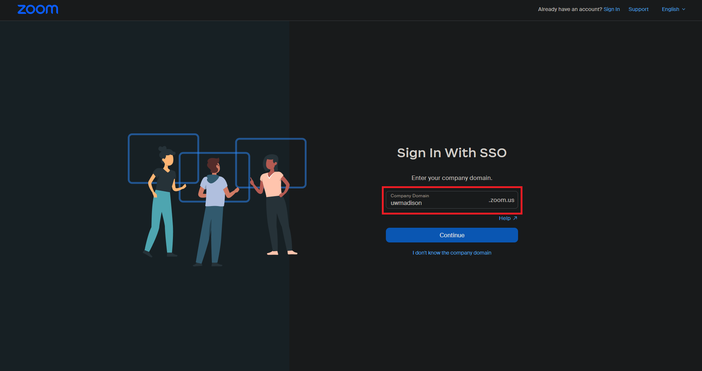
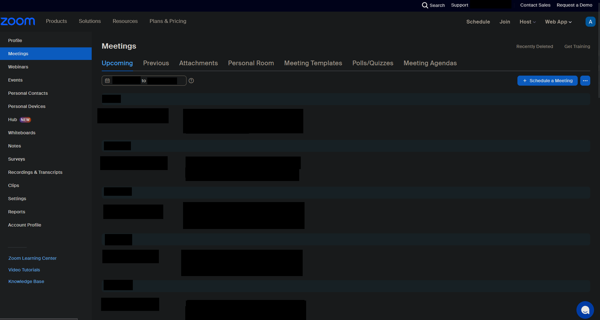
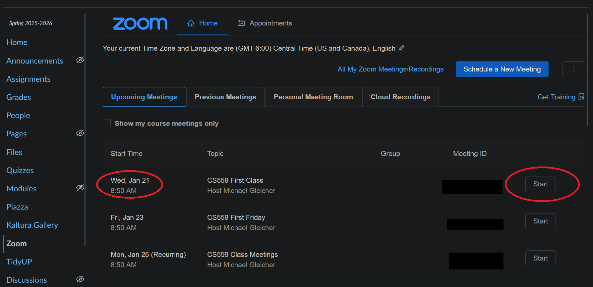
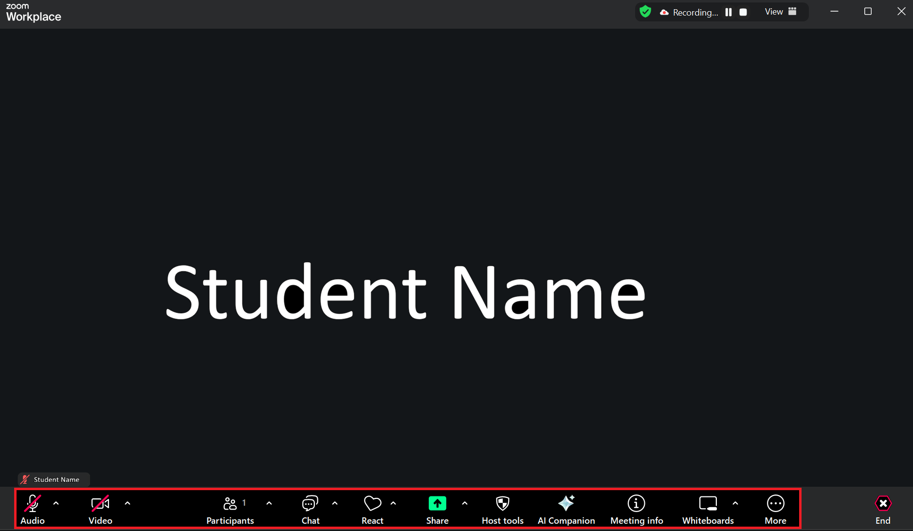
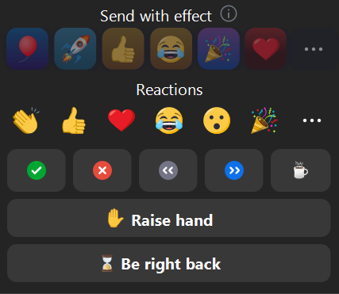

## Getting Started with Zoom

Zoom is a video conferencing platform that we'll use for online class sessions and office hours. This tutorial will help you get set up and familiar with the essential features.

## Installing Zoom

1. Visit [zoom.us/download](https://zoom.us/download)
2. Download the Zoom desktop client (called "Zoom Workplace") for your operating system
3. Install the application following the on-screen instructions
4. Sign into the client using your school email (you may have to sign up)

**Tip:** While you can use Zoom in a web browser, the desktop app provides the best experience with more features.

## Signing In

For class meetings you will need to be an authenticated Zoom user. This means that, when you log into Zoom, you need to sign in using SSO, and the SSO domain needs to be "uwmadison".

### Zoom App

Click on the SSO Login Button and it will open your browser to the school login page.

Login using your school credentials.

After loging in, it should take you back to the Zoom App. If it does not, then check the app to see if you were logged in but not redirected back to the app. If the app still shows that you are not logged in, try logging into the browser-based zoom first before retrying to log into the zoom app.

When you are logged in, the Zoom app should look something like the following.

### Browser-Based Zoom

Click the "Sign In" button on zoom.us.

Click on the "SSO" sign in option.

Type in "uwmadison" into the company domain. And hit "continue".

This should take you to the University of Wisconsin-Madison login page.
Login with your credentials.

After you are done signing in, you should see a page that looks something like this.

## Joining a Meeting

There are multiple ways to join a meeting.
All class meetings can be gotten to through Canvas. 
Other ways of joining a Zoom meeting are explained here in case they come up.

### Through Canvas

 - Go to the Canvas course webpage
 - Look on the left of the webpage and click "Zoom"
 - A webpage will open (on Canvas) with a list of all zoom meeting times
   - If the Webpage has a popup asking for authorization, authorize access
 - Find the meeting time for the Zoom meeting that you want to join
 - Press "Start" for the meeting you are interested in
 - Zoom will attempt to open your local app and join the meeting
   - If you deny it access to open the local app, it will open zoom in browser and join the zoom meeting

### From a Meeting Link
1. Click on the Zoom meeting link
2. The Zoom app will launch automatically
3. Choose whether to join with video and audio
4. Click **Join Meeting**

### From a Meeting ID
1. Open the Zoom app
2. Click **Join**
3. Enter the Meeting ID
4. Enter your name as it should appear to others
5. Click **Join**
6. Enter the passcode if prompted (it must be given to you by the person who gave you the Meeting ID)

## Essential Zoom Controls

Once you're in a meeting, you'll see a control bar at the bottom of the screen.

### Audio
- **Mute/Unmute** (microphone icon): Toggle your microphone on/off
- **Keyboard shortcut:** Hold `Spacebar` to temporarily unmute (Push to Talk)
- **Click the arrow** next to the microphone icon to select different audio devices

### Video
- **Start/Stop Video** (camera icon): Toggle your camera on/off
- **Click the arrow** to access video settings and virtual backgrounds

### Participants

 - View list of attendees and raise your hand

### Chat
 
 - Open/close the global/breakout room chat

### React

 - Clicking this opens a small window
   - Clicking an emoji under "Reactions" will make the emoji float up on the screen for a time
   - Clicking a symbol under the "Reactions" area (i.e. the green checkmark, red x, <<, >>, or coffee) will mark you so that everyone else can see that you clicked a symbol and what symbol you clicked. Clicking the symbol again will remove the mark.
   - Clicking "Raise Hand" will mark you so that everyone can see that you are raising your hand. Click it again to put down your hand.
   - "Be right back" turns off your video and audio feed as well as marks your person so that everyone can see that you are away and will come back later. When you click it again, you will be unmarked and your video and audio feeds will be restored (i.e. turned on if they were on before and turned off if they were off when you started raising your hand)

### Share

 - Click to share your screen (more details down below)

### End

 - Exits the zoom call

## Best Practices for Class

### Before the Meeting
- Test your audio and video in advance
- Join a few minutes early to resolve any technical issues
- Make sure you're in a quiet location with good lighting
- Close unnecessary applications to save bandwidth

### During the Meeting
- **Mute yourself** when not speaking to reduce background noise
- Use the **Raise Hand** feature (in Participants panel) to ask questions
- Keep your video on if possible to increase engagement
- Use the **Chat** for questions or comments without interrupting
- Rename yourself if needed (click on your video → Rename)

### For Group Work
- Use **Breakout Rooms** when assigned by the Professor
- Share your screen when presenting your work
- Use the chat to share links or code snippets
- Stay engaged and communicate with your teammates

## Screen Sharing

To share your screen:
1. Click **Share Screen** in the control bar
2. Select the window or application you want to share
3. Check **Share computer sound** if you're showing a video with audio
4. Check **Optimize for video clip** if sharing video content
5. Click **Share**

**Tips:**
- Share a specific application window rather than your entire screen to avoid showing personal information
- Remember to close sensitive tabs or applications before sharing
- Use the annotation tools to draw or highlight during screen sharing

## Troubleshooting Common Issues

### Can't Hear Others
- Check that your volume is turned up
- Make sure you didn't accidentally join without audio
- Try leaving and rejoining with audio
- Click the arrow next to the microphone icon and select the correct speaker

### Others Can't Hear You
- Check that you're unmuted in Zoom
- Verify your microphone is selected in Zoom settings
- Check your system microphone permissions
- Test your microphone in Zoom settings

### Video Not Working
- Click **Start Video** in the control bar
- Check that Zoom has camera permissions on your system
- Try stopping and starting your video again
- Restart the Zoom application

### Poor Connection
- Turn off your video to save bandwidth
- Close other applications using internet
- Move closer to your WiFi router
- Consider using a wired ethernet connection

## Virtual Backgrounds

To use a virtual background:
1. Click the arrow next to **Start/Stop Video**
2. Select **Choose Virtual Background**
3. Pick a preset background or upload your own
4. For best results, use a plain wall behind you or enable background blur

## Keyboard Shortcuts

Useful shortcuts to improve your Zoom experience:

- `Alt + A` (Windows) / `Cmd + Shift + A` (Mac): Mute/unmute audio
- `Alt + V` (Windows) / `Cmd + Shift + V` (Mac): Start/stop video
- `Alt + S` (Windows) / `Cmd + Shift + S` (Mac): Share screen
- `Alt + H` (Windows) / `Cmd + Shift + H` (Mac): Show/hide chat

[More Shortcuts](https://support.zoom.com/hc/en/article?id=zm_kb&sysparm_article=KB0067050)

## Privacy and Security

- Never share meeting links publicly
- Wait for the host to admit you from the waiting room
- Don't share meeting IDs or passcodes on social media
- Be aware that sessions may be recorded
- Use appropriate backgrounds and be mindful of what's visible in your video

## Additional Resources

- [Zoom Help Center](https://support.zoom.us/)
- [Zoom Video Tutorials](https://support.zoom.us/hc/en-us/articles/206618765-Zoom-Video-Tutorials)

## Getting Help

If you experience technical difficulties:
1. Check the troubleshooting section above
2. Visit the [Zoom Help Center](https://support.zoom.us/)
3. Contact DoIT for support
4. Email the TAs/Professor if you have persistent issues
