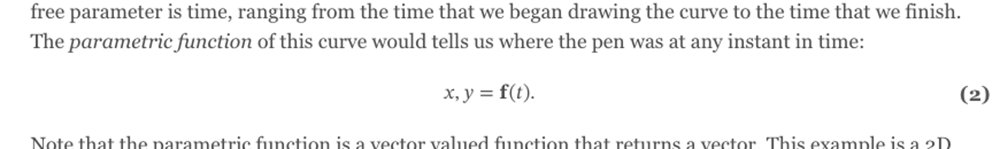

# Math-bold-in-Chromium: validation on this site's real content

**Status: bug confirmed here (2026-07-13); fix built in the theme and
re-validated here (2026-07-14).** Full investigation, root-cause analysis,
the recommended fix, and its implementation live in the theme at
[`themes/559Theme/docs/math-bold-research/README.md`](../../themes/559Theme/docs/math-bold-research/README.md).
This document does not repeat that analysis. It records that the bug
reproduced on this site's actual math content (not just the theme's
synthetic test rigs), how that was confirmed, and — now — that the fix was
re-validated against the same content.

> **Fix re-validated on this site (2026-07-14).** With the theme's
> mathvariant transform applied, equation (2) on `content/splines/1/` renders
> genuinely bold: in Chromium the substituted Unicode glyphs carry ~30–40 %
> more ink than plain (the old `mathvariant="bold"` measured identical to
> plain — the bug); in Firefox the new form is pixel-identical to the form
> Firefox already bolded (no regression, no double-bold). Side-by-side evidence
> (rows: A plain / B old `mathvariant` / C new Unicode fix):
> [Chromium](img/after-fix-eq2-compare-chromium.png) — B is identical to A (the
> bug), C is bold; [Firefox](img/after-fix-eq2-compare-firefox.png) — B and C
> both bold and identical.
> Deployment note: the fix ships when this site's `themes/559Theme` submodule
> is bumped to the theme commit carrying it.

## The problem, in one paragraph

Math renders at build time via Hugo's `transform.ToMath` (KaTeX), output as
MathML. Structurally this renders correctly with no CSS/JS/fonts needed.
The one failure: `\mathbf{...}` / `\boldsymbol{...}` render at **normal**
weight in Chromium (and Chromium-family browsers), because Chromium's
MathML Core implementation ignores the `mathvariant="bold"` attribute KaTeX
emits. Firefox honors the attribute and renders correct bold. See the
theme doc above for why, what was tried, and the recommended fix (Unicode
Mathematical-Alphanumeric substitution at build time).

## Why this site

This site has the theme's best collection of real `\mathbf`/`\boldsymbol`
usage — the splines/curves tutorial content, written independently of this
bug, not as a test case for it:

- `content/splines/1/index.md`
- `content/splines/2/index.md`
- `content/splines/3/index.md`
- `content/splines/4/index.md`
- `content/splines/5/index.md`
- `content/splines/6-bez/index.md` (plus `new-bezier.tex`, a source doc, not
  rendered directly)
- `content/splines/6-bsp/index.md`

`content/splines/1/index.md`'s equation (2), `x, y = \mathbf{f}(t)`, was
used as the primary test subject below — it's simple (one bold glyph) and
easy to re-locate for future re-testing.

## Validation performed (2026-07-13/14)

Two independent methods, both against this site's actual rendered output
(not the theme's synthetic rigs), using a local `hugo server` and Playwright
(Chromium) / headless Firefox:

### Chromium: DOM measurement

Rather than screenshots (Playwright's screenshot tool reliably times out in
this environment — see "Tooling note" below), the check compared the bold
and plain renderings of the same glyph directly in the DOM:

```js
// on content/splines/1/, comparing the bold "f" in equation (2)
// against a plain (non-bold) "f" elsewhere on the page
{
  boldF:  { fontWeight: "400", fontFamily: "math" },  // <mi mathvariant="bold">f</mi>
  plainF: { fontWeight: "400", fontFamily: "math" },  // <mi>f</mi>
}
// getBoundingClientRect().width: both 10.15625px, byte-identical
```

Both the computed `font-weight` and the rendered glyph width are
**identical** between the bold and plain glyph. Chromium is not applying
any visual distinction for `mathvariant="bold"` — confirming the theme
doc's finding, now on this site's real content rather than a test rig.

### Firefox: screenshot

Headless Firefox (`firefox --headless --screenshot`, isolated profile so it
didn't disturb an already-open regular Firefox window) on the same page and
equation:



The `f` in `x, y = **f**(t)` renders visibly bold, matching the weight of
the bold `(2)` equation-number label beside it — Firefox needs no fix.

### Conclusion

The bug is real and reproducible on this site's actual tutorial content, in
both directions (Chromium fails, Firefox is fine), matching the theme
research doc's findings exactly. This site is a good target for validating
whichever fix gets implemented (Path B: Unicode substitution, per the theme
doc's recommendation) — re-run both checks above against the same
equation after the fix lands, plus spot-check the other pages listed above
for glyph variety (the splines pages use bold Latin letters; check whether
any site content exercises bold Greek/script/other variants KaTeX supports,
since the fix's mapping-table completeness is the main risk called out in
the theme doc).

## Tooling note for whoever picks this up

Playwright's `browser_take_screenshot` reliably hit a 5-second tool timeout —
originally guessed to be a blocked Google-Fonts fetch, but **that was wrong**.
The real cause (found 2026-07-14): this Playwright MCP is configured with
`--cdp-endpoint http://localhost:9222`, i.e. it **attaches to the user's real,
running Google Chrome** rather than a private headless browser — and several
stale `playwright-mcp` instances from earlier sessions were all attached to that
same Chrome at once. Multiple controllers contending for one browser makes the
screenshot's "wait for stable / fonts ready" step hang past the 5 s cap (note the
log even prints "fonts loaded" *before* timing out — so fonts aren't the
blocker). `browser_evaluate` (DOM/canvas measurement) still works because it's a
quick one-shot call.

What actually works for screenshots — **launch a browser directly, with its own
profile, bypassing the MCP** (no contention, no shared state):

- **Headless Chrome:** `"/Applications/Google Chrome.app/Contents/MacOS/Google
  Chrome" --headless=new --disable-gpu --user-data-dir=/tmp/chrome-x
  --window-size=W,H --virtual-time-budget=4000 --screenshot=out.png URL`
  (the separate `--user-data-dir` is what lets it run alongside the user's Chrome).
- **Headless Firefox:** `firefox --headless --new-instance --profile /tmp/ff-x
  --screenshot out.png URL`.
- **DOM/canvas measurement** via `browser_evaluate` (computed style, bounding
  rect, or a canvas *ink-pixel count* — the right metric for boldness, since
  advance width is confounded by italic vs upright shapes).

The after-fix screenshots in `img/` were captured with the headless-Chrome and
headless-Firefox commands above. If the MCP screenshot is ever needed, first kill
the stale `playwright-mcp --cdp-endpoint ...:9222` processes so only one
controller drives the shared Chrome.
